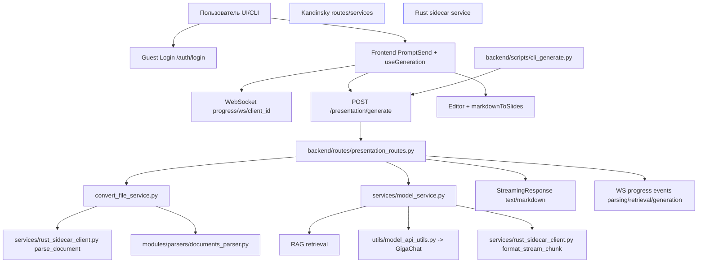

# Converter_pptx v2 (этап 1)

Генерация презентаций из документов с потоковой выдачей markdown, прогрессом этапов через WebSocket, гостевым режимом входа и опциональным frontend.

## Ключевые возможности

- **Гостевой вход** (кнопка «Войти как гость») без полноценной auth-системы.
- **Два стрима**:
  - markdown-стрим: `POST /api/presentation/generate`
  - прогресс-стрим этапов `parsing → retrieval → generation`: `WS /api/presentation/progress/ws/{client_id}`
- **CLI-режим**: генерация без запуска frontend.
- **Feature flags** для Rust sidecar, Kandinsky, DB toggle admin, progress WS.
- **Светлая/тёмная темы** с переключателем ☀️/🌙.
- **KPI presets**: «Строгий» и «Доклад» с подсказками в UI.

---

## Архитектура (вариант A: модульный monorepo + умеренная декомпозиция)

- `frontend/` — React/TS UI.
- `backend/` — FastAPI (Python 3.10), orchestration и API.
- `rust_sidecar/` — Rust sidecar для hot paths (parser/AST/formatter), включается флагом.

### Схема модулей: от запроса до презентации



---

## Контейнеры (умеренный набор 4–6)

Базовый compose (4 контейнера):
- `nginx`
- `frontend`
- `backend`
- `postgres`

Опционально (профили):
- `rust-sidecar` (profile `rust`)

---

## Сборка и запуск через Docker Compose

### 1) Подготовка env

```bash
cp backend/.env.example backend/.env
cp frontend/.env.example frontend/.env
```

### 2) Запуск базового стека

```bash
docker compose up -d --build
```

### 3) Запуск с Rust sidecar

```bash
docker compose --profile rust up -d --build
```

### 4) Проверка

```bash
curl -I http://localhost:8000/api/docs
curl -I http://localhost:3000
```

---

## Запуск без frontend (CLI/API-only)

```bash
docker compose up -d backend postgres
python backend/scripts/cli_generate.py \
  --api http://localhost:8000/api \
  --file /path/to/file.pdf \
  --text "Сделай презентацию" \
  --model GigaChat-2-Pro \
  --out result.md
```

---

## Feature flags

`backend/.env`:

- `FEATURE_RUST_SIDECAR` — включить Rust sidecar интеграцию.
- `FEATURE_KANDINSKY` — включить Kandinsky API.
- `FEATURE_PROGRESS_WS` — включить WebSocket прогресс.
- `FEATURE_DB_TOGGLE_ADMIN` — админ-переключатель БД.

`frontend/.env`:

- `REACT_APP_ADMIN_USE_DATABASE` — глобальный дефолт DB toggle для UI.

---

## Kandinsky (versioned API schema + auto provider)

Логика выбора:
1. если задан `KANDINSKY_INTERNAL_URL` → используется внутренний API;
2. иначе, если задан `KANDINSKY_PUBLIC_URL` → используется публичный провайдер.

Контракт (v1):
- `POST /api/kandinsky/v1/generate-image`
- `POST /api/kandinsky/v1/style-transfer`

Поддержка сценариев:
- image generation;
- template style transfer:
  - `template_image_url` (PNG/JPG),
  - либо `template_id` предустановленного шаблона.

---

## Windows

План внедрения (следующий этап):
- native запуск без Docker;
- сценарий Docker Desktop/WSL2;
- единый инсталлятор `.msi/.exe`.

(В текущем этапе добавлены backend/frontend сценарии и Docker Compose.)

---

## Безопасность и эксплуатация

- Секреты только через env/secret store.
- Гостевой режим отделён и валидация ужесточена.
- История/чаты в guest-режиме не сохраняются.
- Контейнерный набор оставлен умеренным (4–6).
- CORS задаётся через `CORS_ORIGINS` (без wildcard в production).
- На `/api/presentation/generate` включён базовый rate-limit (in-memory).

---

## Rust sidecar: hot paths и benchmarks

- Реализованы hot-path эндпоинты:
  - `/parse` — быстрая нормализация документа в markdown;
  - `/ast` — markdown → AST узлы;
  - `/format` — быстрый форматтер чанков.
- Добавлены нагрузочные тесты (criterion): `rust_sidecar/benches/hot_paths.rs`.

---

## Windows installer pipeline (.msi)

- Добавлен WiX-шаблон: `packaging/windows/installer.wxs`.
- Добавлен скрипт сборки: `scripts/build_windows_msi.ps1`.
- Добавлен CI workflow: `.github/workflows/windows-installer.yml` с артефактом MSI.
